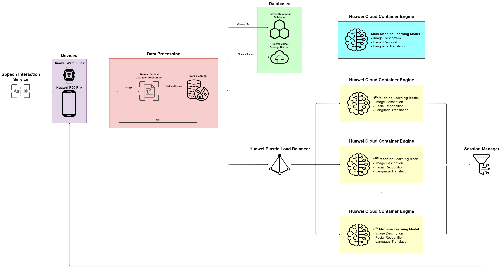

# Huawei Developer Competition 2023

### Software Architecture Diagram
<!-- create tag to input image of mockup6.png from imgaes directory -->

1. A user will input voice command to tell smart watch or smartphone what he/she would like to do through the Speech Interaction Service
2. The device will then scan the image / text through the built-in camera function
3. The data retrieved from scanning will be stored with a unique identifier, the ID of the device
4. The image file will be passed through Huawei's Optical Character Recognition (OCR) solution to extract the text from the image  
&nbsp;&nbsp;&nbsp;&nbsp; a. Both the text and the image will then go through a Data Cleaning process  
&nbsp;&nbsp;&nbsp;&nbsp;&nbsp;&nbsp;&nbsp;&nbsp; - e.g. image re-sizing, image enhancing  
&nbsp;&nbsp;&nbsp;&nbsp;&nbsp;&nbsp;&nbsp;&nbsp; - e.g. tokenization, stop words removal, stemming and lemmatization
5. The text file will skip not be passed into the OCR but directly to the Data Cleaning process
6. The process will now be split into 2 parts, where the cleaned dataset will be sent to both the load balancer and the databases
7. The cleaned dataset will be sent to the database first:  
&nbsp;&nbsp;&nbsp;&nbsp; a. Structured data such as the cleaned image will be sent to the Huawei object Storage (OBS)  
&nbsp;&nbsp;&nbsp;&nbsp; b. Unstructured data such as the cleaned text will be sent to the Huawei Cloud Database Service (CDS)  
&nbsp;&nbsp;&nbsp;&nbsp; - Developers will have access to the Main Machine Learning model, where they can train the model using the data extracted from the database, containerize the model using the Huawei cloud Container Engine after testing and the exact models can be deployed on other machines to run to generate the desired output to be sent back to the original device
~~~
- The machine learning model will mainly be focusing on image and facial recognition, with the use of open sources such as HuggingFace and DeepFace
- For the translation service, we will be using the built-in Real-Time Translation API from Huawei. 
~~~
8. The same set of cleaned data, along with the unique ID will be passed into the Huawei Elastic Load Balancer, which manages the load on the backend server, reducing the potential downtime / slowness which will affect user's ease of use of huawei's product
9. Both steps 8 and 9 run concurrently and will not have a clash with one another
10. The machine model to be used will be the latest model from the container
11. The output from the machine learning model will be in the form of a string in a text file, to be sent to the Session Manager which directs the exact output back to its original device
12. The device will then be using a built-in Text-to-Speech function by taking in the string input and output as a sound to the user